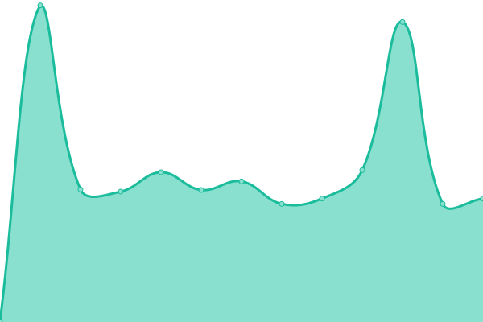
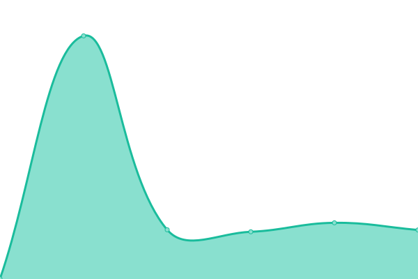
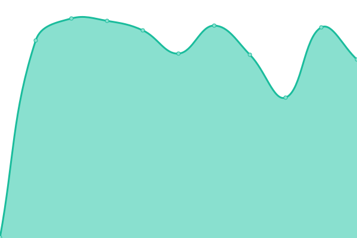
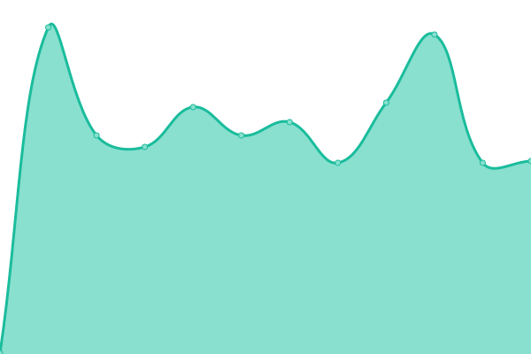
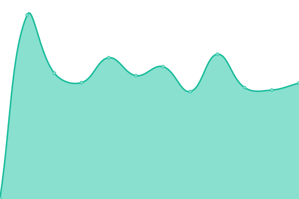

# [📈 Live Status](https://upptime.github.io/upptime): <!--live status--> **🟨 Degraded performance**

This repository contains the open-source uptime monitor and status page for [Upptime](https://upptime.js.org), powered by [Upptime](https://github.com/upptime/upptime).

With [Upptime](https://upptime.js.org), you can get your own unlimited and free uptime monitor and status page, powered entirely by a GitHub repository. We use [Issues](https://github.com/upptime/upptime/issues) as incident reports, [Actions](https://github.com/bgd-labs/uptime/actions) as uptime monitors, and [Pages](https://upptime.github.io/upptime) for the status page.

<!--start: status pages-->
<!-- This summary is generated by Upptime (https://github.com/upptime/upptime) -->
<!-- Do not edit this manually, your changes will be overwritten -->
<!-- prettier-ignore -->
| URL | Status | History | Response Time | Uptime |
| --- | ------ | ------- | ------------- | ------ |
|  [Indexer](https://indexer.staging.bgdlabs.com) | 🟩 Up | [indexer.yml](https://github.com/bgd-labs/uptime/commits/HEAD/history/indexer.yml) | 

 551ms
     
 | 

<a href="https://status.bgdlabs.com/history/indexer">100.00%</a>
    

|  [Coolify](https://app.coolify.io) | 🟩 Up | [coolify.yml](https://github.com/bgd-labs/uptime/commits/HEAD/history/coolify.yml) | 

 718ms
     
 | 

<a href="https://status.bgdlabs.com/history/coolify">99.92%</a>
    

|  [Indexer (indexing)](https://indexer.staging.bgdlabs.com/status/logs?minBehind=1000) | 🟨 Degraded | [indexer-indexing.yml](https://github.com/bgd-labs/uptime/commits/HEAD/history/indexer-indexing.yml) | 

 872ms
     
 | 

<a href="https://status.bgdlabs.com/history/indexer-indexing">84.70%</a>
    

|  [Indexer (mainnet)](https://indexer.staging.bgdlabs.com/status/logs?minBehind=1000&chainId=1) | 🟩 Up | [indexer-mainnet.yml](https://github.com/bgd-labs/uptime/commits/HEAD/history/indexer-mainnet.yml) | 

 257ms
     
 | 

<a href="https://status.bgdlabs.com/history/indexer-mainnet">100.00%</a>
    

|  [Indexer (arbitrum)](https://indexer.staging.bgdlabs.com/status/logs?minBehind=1000&chainId=42161) | 🟨 Degraded | [indexer-arbitrum.yml](https://github.com/bgd-labs/uptime/commits/HEAD/history/indexer-arbitrum.yml) | 

 259ms
     
 | 

<a href="https://status.bgdlabs.com/history/indexer-arbitrum">84.95%</a>
    

|  [Indexer (avalanche)](https://indexer.staging.bgdlabs.com/status/logs?minBehind=1000&chainId=43114) | 🟩 Up | [indexer-avalanche.yml](https://github.com/bgd-labs/uptime/commits/HEAD/history/indexer-avalanche.yml) | 

 298ms
     
 | 

<a href="https://status.bgdlabs.com/history/indexer-avalanche">98.79%</a>
    

|  [Indexer (base)](https://indexer.staging.bgdlabs.com/status/logs?minBehind=1000&chainId=8453) | 🟩 Up | [indexer-base.yml](https://github.com/bgd-labs/uptime/commits/HEAD/history/indexer-base.yml) | 

 259ms
     
 | 

<a href="https://status.bgdlabs.com/history/indexer-base">100.00%</a>
    

|  [Indexer (bnb)](https://indexer.staging.bgdlabs.com/status/logs?minBehind=1000&chainId=56) | 🟨 Degraded | [indexer-bnb.yml](https://github.com/bgd-labs/uptime/commits/HEAD/history/indexer-bnb.yml) | 

 279ms
     
 | 

<a href="https://status.bgdlabs.com/history/indexer-bnb">99.00%</a>
    

|  [Indexer (celo)](https://indexer.staging.bgdlabs.com/status/logs?minBehind=1000&chainId=42220) | 🟩 Up | [indexer-celo.yml](https://github.com/bgd-labs/uptime/commits/HEAD/history/indexer-celo.yml) | 

 340ms
     
 | 

<a href="https://status.bgdlabs.com/history/indexer-celo">100.00%</a>
    

|  [Indexer (gnosis)](https://indexer.staging.bgdlabs.com/status/logs?minBehind=1000&chainId=100) | 🟩 Up | [indexer-gnosis.yml](https://github.com/bgd-labs/uptime/commits/HEAD/history/indexer-gnosis.yml) | 

 256ms
     
 | 

<a href="https://status.bgdlabs.com/history/indexer-gnosis">100.00%</a>
    

|  [Indexer (linea)](https://indexer.staging.bgdlabs.com/status/logs?minBehind=1000&chainId=42220) | 🟩 Up | [indexer-linea.yml](https://github.com/bgd-labs/uptime/commits/HEAD/history/indexer-linea.yml) | 

 247ms
     
 | 

<a href="https://status.bgdlabs.com/history/indexer-linea">100.00%</a>
    

|  [Indexer (metis)](https://indexer.staging.bgdlabs.com/status/logs?minBehind=1000&chainId=1088) | 🟩 Up | [indexer-metis.yml](https://github.com/bgd-labs/uptime/commits/HEAD/history/indexer-metis.yml) | 

 333ms
     
 | 

<a href="https://status.bgdlabs.com/history/indexer-metis">96.43%</a>
    

|  [Indexer (optimism)](https://indexer.staging.bgdlabs.com/status/logs?minBehind=1000&chainId=10) | 🟩 Up | [indexer-optimism.yml](https://github.com/bgd-labs/uptime/commits/HEAD/history/indexer-optimism.yml) | 

 264ms
     
 | 

<a href="https://status.bgdlabs.com/history/indexer-optimism">92.50%</a>
    

|  [Indexer (plasma)](https://indexer.staging.bgdlabs.com/status/logs?minBehind=1000&chainId=9745) | 🟩 Up | [indexer-plasma.yml](https://github.com/bgd-labs/uptime/commits/HEAD/history/indexer-plasma.yml) | 

 307ms
     
 | 

<a href="https://status.bgdlabs.com/history/indexer-plasma">100.00%</a>
    

|  [Indexer (polygon)](https://indexer.staging.bgdlabs.com/status/logs?minBehind=1000&chainId=137) | 🟩 Up | [indexer-polygon.yml](https://github.com/bgd-labs/uptime/commits/HEAD/history/indexer-polygon.yml) | 

 281ms
     
 | 

<a href="https://status.bgdlabs.com/history/indexer-polygon">91.71%</a>
    

|  [Indexer (scroll)](https://indexer.staging.bgdlabs.com/status/logs?minBehind=1000&chainId=534352) | 🟩 Up | [indexer-scroll.yml](https://github.com/bgd-labs/uptime/commits/HEAD/history/indexer-scroll.yml) | 

 259ms
     
 | 

<a href="https://status.bgdlabs.com/history/indexer-scroll">100.00%</a>
    

|  [Indexer (soneium)](https://indexer.staging.bgdlabs.com/status/logs?minBehind=1000&chainId=1868) | 🟩 Up | [indexer-soneium.yml](https://github.com/bgd-labs/uptime/commits/HEAD/history/indexer-soneium.yml) | 

 253ms
     
 | 

<a href="https://status.bgdlabs.com/history/indexer-soneium">99.87%</a>
    

|  [Indexer (sonic)](https://indexer.staging.bgdlabs.com/status/logs?minBehind=1000&chainId=146) | 🟩 Up | [indexer-sonic.yml](https://github.com/bgd-labs/uptime/commits/HEAD/history/indexer-sonic.yml) | 

 275ms
     
 | 

<a href="https://status.bgdlabs.com/history/indexer-sonic">100.00%</a>
    

|  [Indexer (zksync)](https://indexer.staging.bgdlabs.com/status/logs?minBehind=1000&chainId=324) | 🟩 Up | [indexer-zksync.yml](https://github.com/bgd-labs/uptime/commits/HEAD/history/indexer-zksync.yml) | 

 254ms
     
 | 

<a href="https://status.bgdlabs.com/history/indexer-zksync">100.00%</a>
    

<!--end: status pages-->

[**Visit our status website →**](https://upptime.github.io/upptime)

## 📄 License

- Powered by: [Upptime](https://github.com/upptime/upptime)
- Code: [MIT](./LICENSE) © [Anand Chowdhary](https://anandchowdhary.com), supported by [Pabio](https://pabio.com)
- Data in the `./history` directory: [Open Database License](https://opendatacommons.org/licenses/odbl/1-0/)
