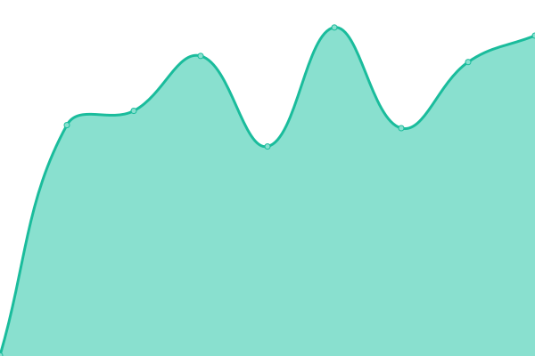

# [📈 Live Status](https://bgd-labs.github.io/uptime): <!--live status--> **🟨 Degraded performance**

This repository contains the open-source uptime monitor and status page for [Bored Ghosts](https://bgdlabs.com), powered by [Upptime](https://github.com/upptime/upptime).

With [Upptime](https://upptime.js.org), you can get your own unlimited and free uptime monitor and status page, powered entirely by a GitHub repository. We use [Issues](https://github.com/bgd-labs/uptime/issues) as incident reports, [Actions](https://github.com/bgd-labs/uptime/actions) as uptime monitors, and [Pages](https://bgd-labs.github.io/uptime) for the status page.

<!--start: status pages-->
<!-- This summary is generated by Upptime (https://github.com/upptime/upptime) -->
<!-- Do not edit this manually, your changes will be overwritten -->
<!-- prettier-ignore -->
| URL | Status | History | Response Time | Uptime |
| --- | ------ | ------- | ------------- | ------ |
|  [Indexer](https://indexer.staging.bgdlabs.com) | 🟩 Up | [indexer.yml](https://github.com/bgd-labs/uptime/commits/HEAD/history/indexer.yml) | 

 560ms
     
 | 

<a href="https://up.bgdlabs.com/history/indexer">100.00%</a>
    

|  [Coolify](https://app.coolify.io) | 🟩 Up | [coolify.yml](https://github.com/bgd-labs/uptime/commits/HEAD/history/coolify.yml) | 

 999ms
     
 | 

<a href="https://up.bgdlabs.com/history/coolify">100.00%</a>
    

|  [Indexer (indexing)](https://indexer.staging.bgdlabs.com/status/logs?minBehind=1000) | 🟩 Up | [indexer-indexing.yml](https://github.com/bgd-labs/uptime/commits/HEAD/history/indexer-indexing.yml) | 

 1206ms
     
 | 

<a href="https://up.bgdlabs.com/history/indexer-indexing">80.29%</a>
    

|  [Indexer (processing)](https://indexer.staging.bgdlabs.com/status/queue-stats?minBehind=10000) | 🟨 Degraded | [indexer-processing.yml](https://github.com/bgd-labs/uptime/commits/HEAD/history/indexer-processing.yml) | 

 334ms
     
 | 

<a href="https://up.bgdlabs.com/history/indexer-processing">82.69%</a>
    

<!--end: status pages-->

[**Visit our status website →**](https://bgd-labs.github.io/uptime)

## 📄 License

- Powered by: [Upptime](https://github.com/upptime/upptime)
- Code: [MIT](./LICENSE) © [Anand Chowdhary](https://anandchowdhary.com), supported by [Pabio](https://pabio.com)
- Data in the `./history` directory: [Open Database License](https://opendatacommons.org/licenses/odbl/1-0/)
